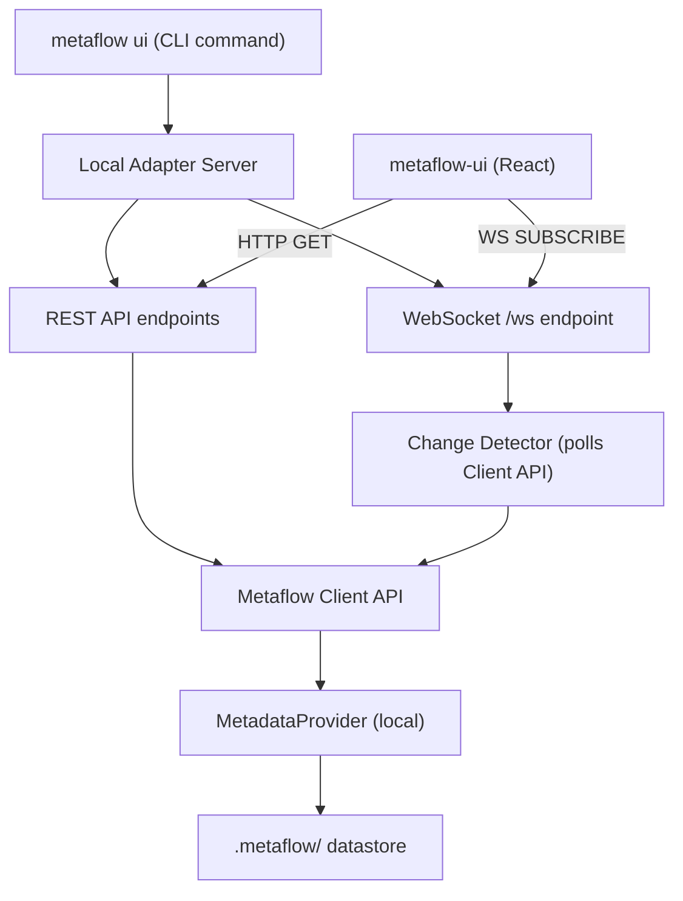

# Standalone Local Mode Implementation Plan

## What Standalone Local Mode Is (and Is Not)

**What it is:**

- A developer experience improvement for local run inspection
- A thin, read-only, stateless translation layer: `Metaflow Client API -> JSON -> UI`
- An ephemeral local server launched via `metaflow ui` for the duration of a dev session
- A way to view runs from the local `.metaflow` datastore without deploying Metaflow Service

**What it is NOT:**

- NOT a replacement for Metaflow Service (the production metadata backend)
- NOT a distributed or production backend
- NOT a new storage abstraction or database
- NOT a system that modifies runs, artifacts, metadata, or datastore structure
- NOT a place for business logic, data transformations, or storage decisions

**Scope and limitations:**

- Read-only: the adapter never writes to the datastore or modifies metadata
- Stateless: no persistent storage, caches, or session state beyond in-memory ephemeral data
- Local only: binds to localhost, single-user, single-machine
- Depends entirely on the existing Metaflow Client API for all data access

---

## Architecture Overview




**Critical abstraction boundary**: The adapter NEVER directly reads files from `.metaflow/`. All data access flows through:

```
Adapter -> Metaflow Client API -> MetadataProvider -> DataStore
```

This ensures we respect the existing abstraction layers, avoid coupling to the local storage layout, and remain compatible with future changes to the datastore format.

## What you actually build

### Backend

- local adapter server
- REST endpoints
- websocket server
- change detector
- client api wrappers

### Frontend

- DAG visualization
- run comparison UI
- dark mode

---

## Adapter Architectural Boundaries

The adapter's responsibilities and non-responsibilities are:

**The adapter DOES:**

- Receive HTTP/WS requests from the frontend
- Call the Metaflow Client API (`Metaflow()`, `Flow()`, `Run()`, `Step()`, `Task()`)
- Serialize Client API objects into JSON matching the ui_backend_service response schema
- Detect changes by periodically re-querying the Client API and comparing against previous snapshots
- Broadcast change events to subscribed WebSocket clients
- Serve static frontend files (optional)

**The adapter DOES NOT:**

- Parse `.metaflow` directory files directly (no `os.listdir(".metaflow")`, no `open("_meta/_self.json")`)
- Write to or modify the datastore, metadata, runs, artifacts, or tags
- Contain business logic, data transformations, or storage decisions
- Maintain persistent state (no database, no on-disk cache)
- Replace or replicate MetadataProvider or DataStore logic

---

## Key Decisions

- **Web framework**: The framework is an implementation detail. The important requirement is matching the API contract the frontend expects. Either `aiohttp` or `FastAPI` (with `uvicorn`) is acceptable. Both provide HTTP + WebSocket support. We will evaluate both during Phase 1 and choose based on:
  - `aiohttp`: matches what the existing ui_backend_service uses; single dependency
  - `FastAPI + uvicorn`: more modern, auto-generated docs, better developer ergonomics, slightly more dependencies
  - The choice does not affect the API contract or the architecture. Installed as an optional dependency either way (`pip install metaflow[ui]`).
- **API contract**: Mirror the [ui_backend_service API](https://github.com/Netflix/metaflow-service/tree/master/services/ui_backend_service/api) endpoints. The metaflow-ui frontend already knows how to consume `/flows`, `/runs`, `/steps`, `/tasks`, `/logs`, `/dag`, `/ws`. We replicate this contract using Client API reads instead of Postgres queries.
- **CLI location**: Register as a top-level command in `[metaflow/cmd/main_cli.py](metaflow/cmd/main_cli.py)` via `CMDS_DESC`, since `metaflow ui` is not flow-specific (similar to `metaflow status`, `metaflow configure`).
- **No changes** to metadata format, datastore structure, or execution semantics.
- **All data access** goes exclusively through the Metaflow Client API. The adapter is a pure translation layer.

## Existing Patterns to Leverage

- **Card server** (`[metaflow/plugins/cards/card_server.py](metaflow/plugins/cards/card_server.py)`): Implements a local HTTP server with `RunWatcher` thread. The polling-for-changes pattern is a useful reference, but our change detection must go through the Client API rather than directly watching files.
- **Client API** (`[metaflow/client/core.py](metaflow/client/core.py)`): `Metaflow()`, `Flow()`, `Run()`, `Step()`, `Task()`, `DataArtifact()` classes already support local mode. All data retrieval goes through these.
- `**_graph_info` artifact**: Stored automatically during every run as `self._graph_info` in `[metaflow/flowspec.py](metaflow/flowspec.py)` (line 514-545). Contains the full DAG structure (`steps`, `graph_structure`, `parameters`, `decorators`). Accessed via `Task('Flow/run/start/task')['_graph_info'].data`. No flow source code is needed.
- **ServiceMetadataProvider** (`[metaflow/plugins/metadata_providers/service.py](metaflow/plugins/metadata_providers/service.py)`): Its `_obj_path()` method (line 386-405) shows the exact REST path structure that the frontend expects.

---

## Phase 1: CLI Command and Server Skeleton

**Goal**: `metaflow ui` starts a server on localhost, prints URL, optionally opens browser.

**Files to create/modify**:

- Create `[metaflow/cmd/ui_cmd.py](metaflow/cmd/ui_cmd.py)` -- the CLI command module
- Modify `[metaflow/cmd/main_cli.py](metaflow/cmd/main_cli.py)` -- add `("ui", ".ui_cmd.cli")` to `CMDS_DESC`
- Modify `[setup.py](setup.py)` -- add optional dependency under `extras_require`

The CLI command:

```python
@click.group()
def cli():
    pass

@cli.command(help="Launch a local UI server for viewing Metaflow runs.")
@click.option("--port", default=8083, help="Port to serve on")
@click.option("--host", default="127.0.0.1", help="Host to bind to")
@click.option("--no-browser", is_flag=True, help="Don't open browser automatically")
@click.option("--datastore-root", default=None, help="Path to .metaflow directory")
def start(port, host, no_browser, datastore_root):
    # 1. Validate web framework is installed (fail with helpful message if not)
    # 2. Locate .metaflow datastore (reuse LocalStorage.get_datastore_root_from_config)
    # 3. Configure namespace(None) + metadata("local@{path}")
    # 4. Start web server
    # 5. Optionally open browser
```

---

## Phase 2: Core REST API Endpoints

**Goal**: Implement the minimum REST endpoints the metaflow-ui frontend needs.

**File to create**: `[metaflow/cmd/ui/](metaflow/cmd/ui/)` package

**Endpoints** (mirroring ui_backend_service):

- `GET /flows` -- `Metaflow().flows`
- `GET /flows/{flow_id}` -- `Flow(flow_id)`
- `GET /flows/{flow_id}/runs` -- `Flow(flow_id).runs()`
- `GET /flows/{flow_id}/runs/{run_number}` -- `Run(f"{flow_id}/{run_number}")`
- `GET /flows/{flow_id}/runs/{run_number}/parameters` -- parameters from `_parameters` step
- `GET /flows/{flow_id}/runs/{run_number}/steps` -- `Run(...).steps()`
- `GET /flows/{flow_id}/runs/{run_number}/steps/{step_name}` -- `Step(...)`
- `GET /flows/{flow_id}/runs/{run_number}/steps/{step_name}/tasks` -- `Step(...).tasks()`
- `GET /flows/{flow_id}/runs/{run_number}/steps/{step_name}/tasks/{task_id}` -- `Task(...)`
- `GET /flows/{flow_id}/runs/{run_number}/steps/{step_name}/tasks/{task_id}/logs/out` -- `Task(...).stdout`
- `GET /flows/{flow_id}/runs/{run_number}/steps/{step_name}/tasks/{task_id}/logs/err` -- `Task(...).stderr`
- `GET /flows/{flow_id}/runs/{run_number}/dag` -- `Task(...)['_graph_info'].data`
- `GET /ping` -- health check
- `GET /features` -- static feature flags for local mode

**Every endpoint handler** follows the same pattern:

1. Parse path/query parameters
2. Call the Metaflow Client API
3. Serialize the result to JSON matching the ui_backend_service schema
4. Return the response

No direct file access, no business logic, no data transformation beyond serialization.

### API Contract Compatibility Strategy

The risk of subtle schema mismatches between our adapter and the ui_backend_service is real but bounded. To mitigate it:

**Step 1 (before writing serializers):** Audit the exact response schema by cross-referencing three sources:

- The service's `RunRow.serialize()`, `StepRow.serialize()`, `TaskRow.serialize()` in [services/data/models.py](https://github.com/Netflix/metaflow-service/blob/master/services/data/models.py)
- The service's post-processing refiners (which add `finished_at`, `duration`, `status`, `attempt_id`)
- The frontend's TypeScript types in the `metaflow-ui` repo

**Step 2:** Build a field mapping reference. The verified mapping so far:

- `flow_id` -- directly in local `_self.json` and Client API (`run.parent.id`)
- `run_number` / `run_id` -- locally these are the same string; return as both fields
- `user_name` -- stored in `_self.json` by `MetadataProvider._all_obj_elements_static()` (metadata.py line 518-526)
- `ts_epoch` -- stored in `_self.json` in milliseconds; accessible as `self._object["ts_epoch"]`
- `tags` / `system_tags` -- stored as arrays in `_self.json`; Client API: `run.user_tags` / `run.system_tags`
- `finished_at` -- NOT in base record; derive from `Run.finished_at` (reads `run['end'].task['_task_ok'].created_at`)
- `duration` -- NOT in base record; compute `finished_at - ts_epoch`
- `status` -- NOT in base record; derive from `Run.successful` / `Run.finished`
- `last_heartbeat_ts` -- service-specific; return `None` (frontend handles absent heartbeats)
- `attempt_id` (tasks) -- from task metadata; Client API: `Task.current_attempt`

**Step 3:** Write contract tests that validate serializer output against known-good service response shapes.

**Serializers**: Thin functions that extract properties from Client API objects into dicts. Example:

```python
def serialize_run(run: Run) -> dict:
    return {
        "flow_id": run.parent.id,
        "run_number": int(run.id) if run.id.isdigit() else run.id,
        "run_id": run.id,
        "user_name": ...,  # from system_tags or run._object
        "ts_epoch": int(run.created_at.timestamp() * 1000),
        "finished_at": int(run.finished_at.timestamp() * 1000) if run.finished_at else None,
        "duration": ...,  # finished_at - ts_epoch if both present
        "status": "completed" if run.successful else ("failed" if run.finished else "running"),
        "tags": list(run.user_tags),
        "system_tags": list(run.system_tags),
        "last_heartbeat_ts": None,
    }
```

**Pagination**: The frontend sends `_page`, `_limit`, `_order` query params. Implement basic pagination over Client API iterators (slice with offset/limit). Response wrapper format must match the service's `format_response` / `format_response_list` utilities.

---

## Phase 3: WebSocket for Live Updates

**Goal**: Frontend can subscribe to live run/step/task events via `/ws`.

### Change Detection Strategy (Doubt #1 Resolution)

The change detector does NOT parse `.metaflow` files directly. Instead, it works as follows:

1. **Periodic Client API polling**: A background task periodically calls the Client API (e.g., `Metaflow().flows`, `Flow(x).runs()`, `Run(x).steps()`) at a configurable interval (default: 2 seconds).
2. **Snapshot comparison**: It compares the current results against a previous in-memory snapshot (e.g., set of known run IDs, step completion statuses).
3. **Diff generation**: When a difference is detected (new run, step completed, task failed), it generates an event.
4. **Broadcast**: The event is serialized in the ui_backend_service format and broadcast to subscribed WebSocket clients.

This approach:

- Respects the abstraction layers (Client API -> MetadataProvider -> DataStore)
- Works regardless of the underlying storage backend (even if someone points it at a non-local datastore in the future)
- Does not couple to the `.metaflow` directory layout
- Is simple and predictable

### Polling Performance

The poller is **subscription-scoped**: it only queries resources that have active WebSocket subscriptions. If the frontend subscribes to `/flows/MyFlow/runs`, the poller calls `Flow("MyFlow").runs()` -- not the entire metadata tree. Unsubscribed resources are never polled.

For local mode, the `LocalMetadataProvider._get_object_internal` does fast filesystem globs (`_self.json` lookups) that complete in sub-millisecond time for a typical local datastore (tens of runs, not thousands). This is not a scalability concern at standalone mode's intended scale (local development).

Additional optimizations:

- Track last-known object IDs as sets; only serialize genuinely new/changed objects
- Configurable poll interval (default 2-3 seconds)
- Standalone mode documentation will state the intended scale (local development, not production monitoring)

### WebSocket Protocol

Matches the ui_backend_service exactly:

- Client sends: `{"type": "SUBSCRIBE", "uuid": "...", "resource": "/flows/{flow_id}/runs", "since": <epoch>}`
- Server sends: `{"type": "INSERT"|"UPDATE", "uuid": "...", "resource": "/runs", "data": {...}}`
- Custom ping/pong: `"__ping__"` / `"__pong__"`

---

## Phase 4: DAG Generation (Doubt #2 Resolution)

**Goal**: The `/dag` endpoint returns the flow graph structure.

### DAG Resolution Strategy

The `_graph_info` artifact is stored automatically during every run by `[metaflow/flowspec.py](metaflow/flowspec.py)` (line 514-545). It is a regular data artifact saved in the `_parameters` step of the `start` task. It contains:

```python
{
    "file": "myflow.py",
    "parameters": [...],
    "constants": [...],
    "steps": {
        "start": {"type": "start", "next": ["process"], ...},
        "process": {"type": "linear", "next": ["end"], ...},
        "end": {"type": "end", "next": [], ...}
    },
    "graph_structure": [...],
    "doc": "...",
    "decorators": [...]
}
```

**Access method** (exclusively via Client API):

```python
run = Run(f"{flow_id}/{run_number}")
graph_info = run["_parameters"].task["_graph_info"].data
```

**No flow source code is needed.** The adapter does not need to be run from a directory containing the flow file. It can browse runs from any metadata root. The DAG is always available as a stored artifact within the run itself.

**Fallback**: If `_graph_info` is not available (e.g., very old runs or interrupted runs where `_parameters` was never stored), the endpoint returns a 404 with a clear error message. No attempt to parse source code from disk.

---

## Phase 5: Static UI Serving (Integration)

**Goal**: `metaflow ui` serves both the API and the frontend from a single process.

Two modes:

- **Bundled mode**: Serve a pre-built `metaflow-ui` production bundle as static files. The CLI references a local build directory.
- **Dev proxy mode**: `metaflow ui --dev` proxies frontend requests to a separately running `npm start` on the metaflow-ui repo (via CORS headers).

The frontend's `METAFLOW_SERVICE` is set to the adapter's base URL.

---

## Phase 6: Asset Lineage Graph (Stretch Goal)

**Goal**: Derive an artifact-centric lineage view from step-centric run data.

This is new logic that uses only the Client API:

1. Iterates runs and collects artifact names per step via `Task.artifacts`
2. Maps artifact -> producing step -> consuming step (via `_graph_info` step dependencies)
3. Builds a lineage graph: `{artifact_name: {produced_by: step, consumed_by: [steps], runs: [...]}}`
4. Exposes via a new endpoint (e.g., `GET /flows/{flow_id}/lineage`)

This is additive and does not block the core functionality. All reads go through the Client API.

---

## File Structure (New Files)

```
metaflow/cmd/
  ui_cmd.py              # CLI command: metaflow ui start
  ui/
    __init__.py
    app.py               # Web application factory (framework-agnostic interface)
    routes/
      __init__.py
      flows.py            # /flows endpoints
      runs.py             # /runs endpoints
      steps.py            # /steps endpoints
      tasks.py            # /tasks endpoints
      logs.py             # /logs endpoints
      dag.py              # /dag endpoint
      features.py         # /features, /ping
    serializers.py        # Convert Client API objects to JSON dicts
    poller.py             # Change detector: polls Client API for changes
    websocket.py          # WebSocket handler (/ws)
    static.py             # Static file serving for bundled UI
```

---

## Implementation Order (Incremental)

The work is ordered so each phase produces a testable, demonstrable result:

1. **Phase 1** -- CLI + server skeleton. Result: `metaflow ui` starts and serves `/ping`.
2. **Phase 2** -- REST endpoints. Result: frontend can load flows, runs, steps, tasks, logs.
3. **Phase 3** -- WebSocket. Result: frontend receives live updates during flow execution.
4. **Phase 4** -- DAG. Result: frontend renders the flow graph.
5. **Phase 5** -- Static serving. Result: single-command `metaflow ui` with no separate frontend setup.
6. **Phase 6** -- Lineage (stretch). Result: asset-centric view.

---

## Testing Strategy

- **Unit tests**: Use Metaflow's existing test patterns. Create a temporary `.metaflow` directory, run a small flow, then test each endpoint via the web framework's TestClient.
- **Integration tests**: Run `metaflow ui` against a real local datastore and validate JSON responses match expected shapes.
- **Frontend tests**: (In metaflow-ui repo) Cypress tests pointing `METAFLOW_SERVICE` at the local adapter.

---

## Dependencies to Add

In `setup.py`, under `extras_require`:

```python
extras_require={
    "ui": ["aiohttp>=3.8"],
    # OR alternatively:
    # "ui": ["fastapi>=0.100", "uvicorn>=0.20"],
}
```

The web framework is installed as an optional extra. Users who don't need the local UI don't install extra dependencies. The final framework choice will be made during Phase 1 implementation after a lightweight evaluation.