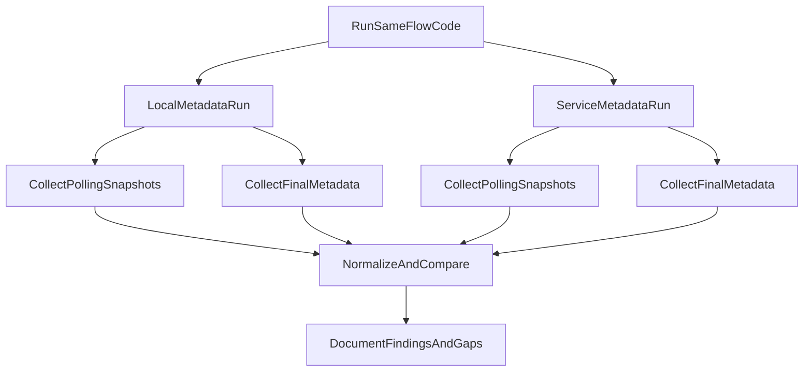

# Investigate Local vs Service Metadata Behavior

## Goal

Establish a reproducible baseline for how run/step/task lifecycle metadata differs (if at all) between local metadata and metadata service, prioritizing:

- run completion detection
- task/step start and failure detection during polling
- retry and end-state visibility

## What We Will Leverage

- Metadata write path in `[/home/rawad/metaflow/metaflow/task.py](/home/rawad/metaflow/metaflow/task.py)`: task-level lifecycle markers are recorded via `register_metadata(...)`, `attempt_ok`, `task_begin`, `task_end`.
- Backend implementations in:
  - `[/home/rawad/metaflow/metaflow/plugins/metadata_providers/local.py](/home/rawad/metaflow/metaflow/plugins/metadata_providers/local.py)`
  - `[/home/rawad/metaflow/metaflow/plugins/metadata_providers/service.py](/home/rawad/metaflow/metaflow/plugins/metadata_providers/service.py)`
- Client-facing status semantics in `[/home/rawad/metaflow/metaflow/client/core.py](/home/rawad/metaflow/metaflow/client/core.py)`:
  - `Task.finished` derived from `_task_ok`
  - `Task.successful` derived from `_success`
  - `Run.finished/successful/finished_at` derived from `end` step task state
- Dev stack instructions in `[/home/rawad/metaflow/arch-docs/getting-started/devstack.md](/home/rawad/metaflow/arch-docs/getting-started/devstack.md)`

## Investigation Design

## Execution Steps

1. Bring up local metadata service using dev stack (`metaflow-dev up`) and open a configured shell (`metaflow-dev shell`).
2. Create one dedicated reproducible flow for metadata observation (single file) with scenarios:
  - normal success path
  - intentional failure path
  - retry path
  - retry scenario where first attempt fails and second attempt succeeds
  - small parallel/foreach branch
  - deliberate sleeps to allow in-flight polling
3. Run this exact flow in two modes with same code and parameters:
  - local backend (`--metadata=local`)
  - service backend (`--metadata=service` in dev stack shell)
4. During each run, poll at short intervals and record snapshots of:
  - `Run.finished`, `Run.successful`, `Run.finished_at`
  - per-step `Step.finished_at`
  - per-task `Task.finished`, `Task.successful`, `Task.finished_at`, `Task.metadata_dict` keys tied to lifecycle
5. After completion, collect final metadata views and compare:
  - presence/absence of lifecycle markers
  - ordering/timing differences
  - visibility lag differences during in-flight polling
6. Execute one targeted failure-window check (medium scope): stop a run mid-execution and observe what each backend exposes at that moment.
7. Document findings in a concise report and classify differences as:
  - expected implementation differences
  - user-visible semantics differences (potentially severe)
  - likely bugs/regressions

## Deliverables

- Repro flow file (for reruns by maintainers).
- Snapshot collection helper script/notebook (or CLI procedure) for deterministic comparison.
- Findings document with concrete examples and recommended next discussion points for maintainer.

## Acceptance Criteria

- Same flow successfully run in both metadata modes.
- At least one in-flight polling timeline captured for both modes.
- Final comparison includes run/step/task completion and failure semantics.
- Findings are written with evidence and clearly indicate whether behavior diverges meaningfully.

## Note:

I want to run the flow myself as well after you, so provivde 

